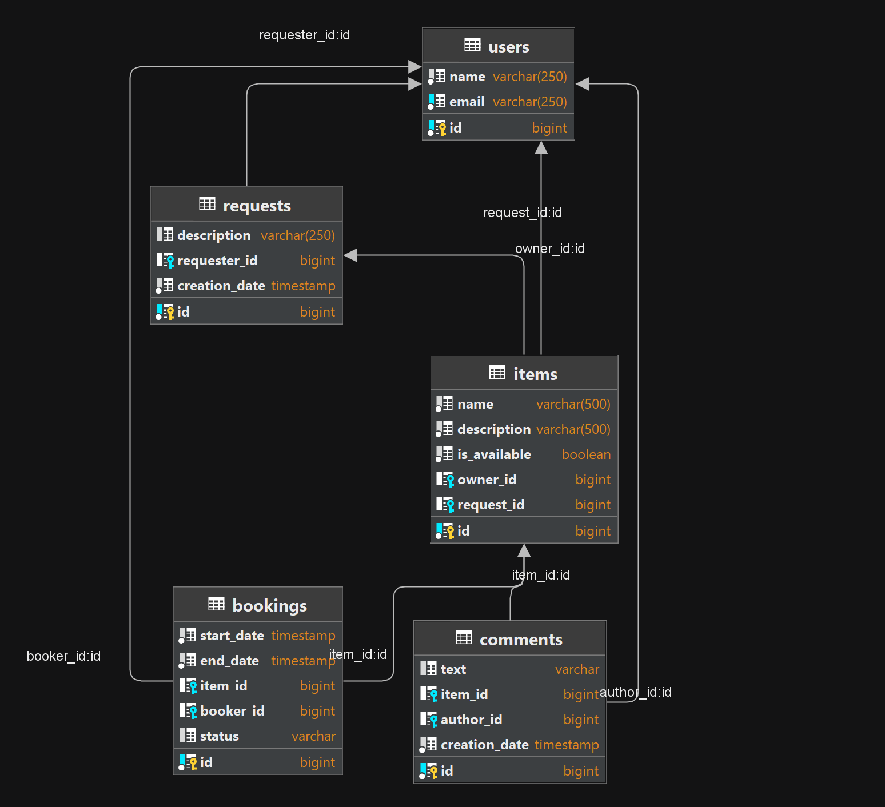

## Shareit - backend service for sharing items.

Shareit allows you to book item for certain dates, close access to items at the time of booking,
add new item to share on request, if the desired item is not available.

### Functional:

1. User can add new items and will be considered its owner, also can add name, description to this item.
2. You can search for item you need. The item is booked for certain dates. The owner of the item must confirm the booking.
3. If the desired item is not found in the search, the user can create a request. The other users can add desire item.
4. After using the item, users can leave feedback.

### Project structure: 
gateway (controller, validates input data) + server (main logic).

### Technology stack:
<a href="https://spring.io/">
  &nbsp;
</a>
<a href="https://maven.apache.org/">
  &nbsp;
</a>
<a href="https://www.postgresql.org/">
  &nbsp;
</a>
<a href="https://www.baeldung.com/the-persistence-layer-with-spring-data-jpa">
  &nbsp;
</a>
<a href="https://hibernate.org/">
  &nbsp;
</a>
<a href="https://projectlombok.org/">
  &nbsp;
</a>

[//]: # (<a href="https://junit.org/junit5/">)

[//]: # (  &nbsp;)

[//]: # (</a>)

<a href="https://site.mockito.org/">
  &nbsp;
</a>
<a href="https://www.docker.com/">
  &nbsp;
</a>

<a href="https://mapstruct.org/">
  &nbsp;
</a>

### System requirements:
JDK 11 amazon corretto  
IntellijIdea

### Startup instructions:
1. Download zip-file  
2. Unpack zip-файл  
3. Open app in IntellijIdea  
4. mvn clean package
5. docker-compose up